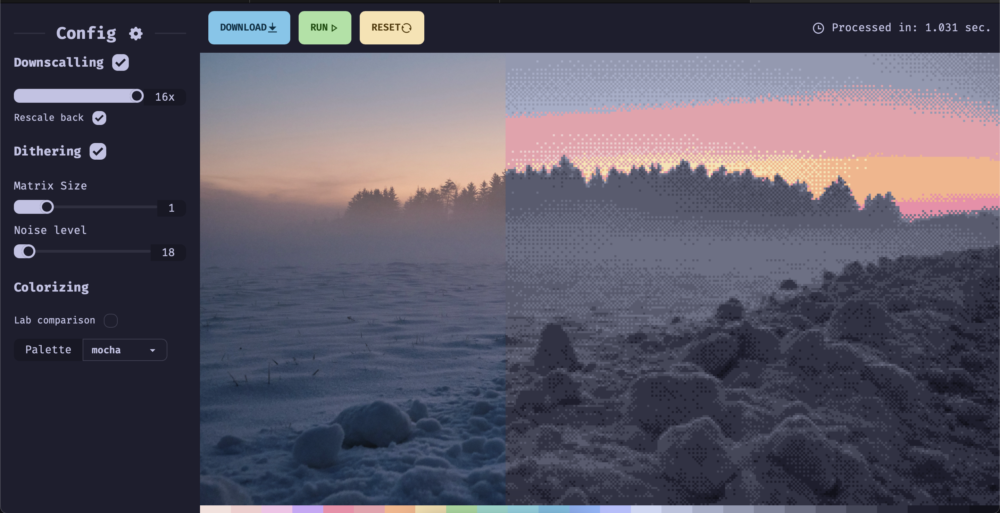
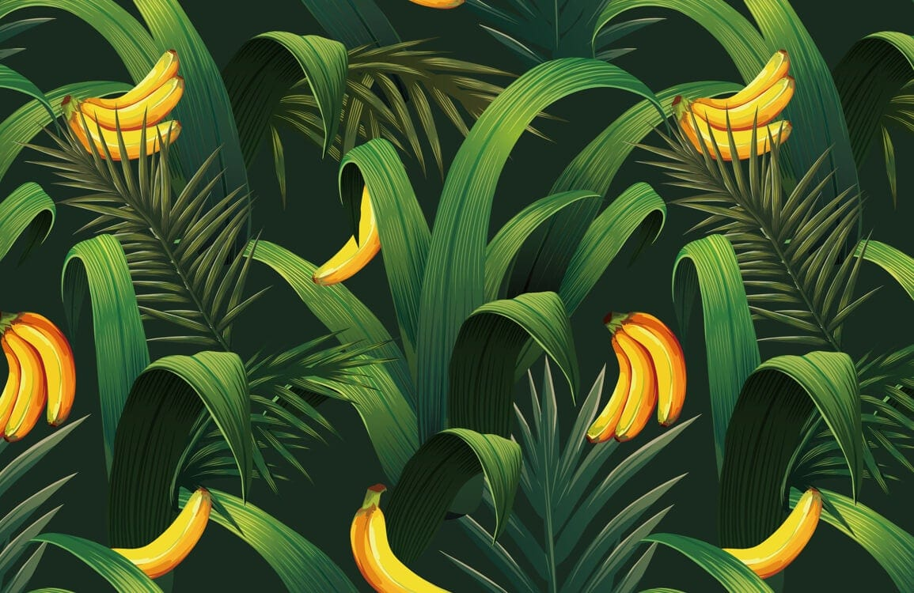
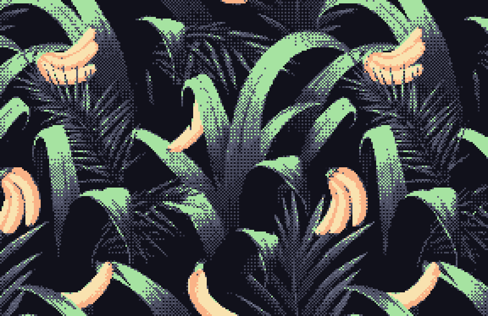

# Nicefy

## Image adjustment to fit theme palette.

> Try it on [Github Pages](https://nicejji.github.io/nicefy/)

## Examples

|         Original image          |        Catppuccin Mocha themed         |
| :-----------------------------: | :------------------------------------: |
|  |  |

## Running locally

- Clone repo
- Install deps with `npm i`
- Run with `npm run dev`
